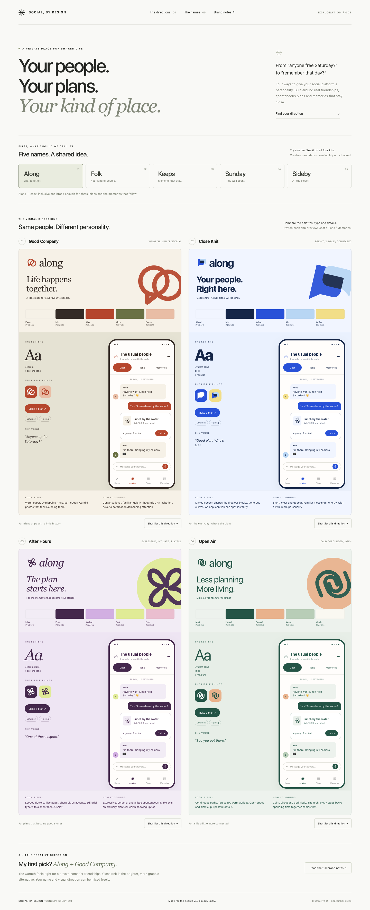

# Larynx

A private social platform where chat connects people, plans and shared memories. The product frontend uses one TypeScript/Expo codebase for web, iOS and Android; the separate backend uses TypeScript, Node.js 24 and Fastify.

The foundation currently provides a universal development shell, operational API probes, PostgreSQL/Garage Docker Compose and CI. Accounts, OAuth, conversations, events and E2EE are roadmap work, not implemented product features.

The [project plan](social_chat_platform_plan.md) records the architecture, client AI and future social features. [GitHub milestones](https://github.com/av-evolv/social-chat-platform/milestones) and [issues](https://github.com/av-evolv/social-chat-platform/issues) track delivery. Work starts with [#1](https://github.com/av-evolv/social-chat-platform/issues/1) and its [planned pull request #29](https://github.com/av-evolv/social-chat-platform/pull/29).

## Run locally

Requirements: Node.js 24 (see `.nvmrc`), npm 11, Docker with Compose. Use `nvm install && nvm use` if you manage Node with nvm.

```sh
cp .env.example .env
npm ci
docker compose up --build --detach --wait
npm run test:infra
```

Open the client at [127.0.0.1:8088](http://127.0.0.1:8088). Operational probes are [liveness](http://127.0.0.1:3000/health/live) and [readiness](http://127.0.0.1:3000/health/ready). Readiness returns 503 while PostgreSQL is unavailable; liveness remains 200 while the API process is running. No product APIs are exposed before OAuth is implemented.

Compose includes PostgreSQL 18 and Garage 2.3, with persistent named volumes. It binds published services to loopback and uses development credentials from `.env.example`; it is a local/CI configuration. Garage automatically initializes its single-node layout and private bucket. `test:infra` configures that development bucket's CORS for `CLIENT_ORIGIN` and removes its own uniquely named test objects afterward. It does not erase other data.

For fast client/backend iteration, run only the infrastructure in Compose and start each app in a separate terminal:

```sh
docker compose stop api client
docker compose up --detach --wait postgres garage
npm run dev:api
```

```sh
npm run dev:web
# Or: npm run dev:client (Expo development server)
```

The universal shell currently makes no API calls. Native development builds can be generated with `npm run ios --workspace @larynx/client` or `npm run android --workspace @larynx/client` once Xcode/Android tooling is installed. Expo SDK 57 requires iOS 16.4+ and Xcode 26.4+; verify real target devices before distribution. Do not commit generated native build artifacts unless the project deliberately adopts that workflow.

Stop services with `docker compose down`; this preserves data. `docker compose down --volumes` deletes this project's local database and object storage. Keep `.env` credentials in sync with initialized volumes; changing environment values alone does not rotate existing database/Garage credentials.

## Verify

```sh
npm run typecheck
npm test
npm run build
npx playwright install chromium
npm run test:infra
npm run test:web
```

The infrastructure and browser checks expect the full Compose stack to be running. `npm run build` compiles the backend and exports the client for web, iOS and Android. Native JavaScript bundles are not native binaries or real-device verification; [#20](https://github.com/av-evolv/social-chat-platform/issues/20) tracks that launch gate.

The infrastructure smoke checks signed two-part uploads, persisted part enumeration, CORS, object size, byte-for-byte signed download, unsigned-access rejection and backend-style cleanup against real Garage. Random test bytes represent opaque payloads; this verifies transport compatibility, not encryption or the future media API. CI also stops/restarts PostgreSQL to verify readiness failure and recovery, and opens the built client at desktop/mobile browser sizes.

Expo native peer versions are constrained to its SDK 57 compatibility matrix to avoid duplicate native modules; the `xcode` UUID override retains its CommonJS API while selecting the patched release. The Router query-decoder advisory is resolved by a narrowly scoped CommonJS compatibility build of upstream decoder 0.5.0 ([#30](https://github.com/av-evolv/social-chat-platform/issues/30)); its [source provenance and removal condition](vendor/decode-uri-component/README.md) are recorded with the vendored package. Bounded malformed-input and callback-style navigation regressions run in `npm test`. Actual OAuth/invitation flows and native device verification remain part of their feature issues. Do not apply incompatible major overrides or `npm audit fix --force`.

## Workspace

- `apps/client`: shared Expo Router screens and future platform adapters.
- `apps/api`: Fastify service, configuration and focused backend tests.
- `infra`: local and CI infrastructure configuration.
- `scripts` and `tests`: cross-service and browser verification.

All future product API calls use OAuth tokens with application/audience/scope controls and object-level authorization. The planned provider is `oidc-provider`; [#4](https://github.com/av-evolv/social-chat-platform/issues/4) owns its integration. Native SQLite and browser IndexedDB, client AI, schema migrations, read replicas and encrypted messaging are selected directions with dedicated roadmap issues.

Storage coordination will use separate internal (`http://garage:3900` inside Compose) and client-reachable signing endpoints. `.env` defines host-side endpoints for verification; adjust the origin/endpoint variables alongside published ports. Never rewrite hosts after signing or expose server S3 credentials as `EXPO_PUBLIC_*` values. Frontend media transfers and transactional deletion workers are [#15](https://github.com/av-evolv/social-chat-platform/issues/15).

## Existing brand explorations

Four visual brand kits for a private, chat-first social platform connecting conversations, events and shared memories.



Open `index.html` in a browser, or run `node server.mjs` and visit http://127.0.0.1:5175. No dependencies or build step are required.

Four independent visual directions and five interchangeable working names. This is a design review prototype; conversations, events, people, and images are illustrative. Name/domain/trademark availability has not been checked.

- **Good Company** — warm editorial, terracotta and olive.
- **Close Knit** — optimistic geometric, cobalt and sky.
- **After Hours** — expressive contemporary, plum and lilac.
- **Open Air** — relaxed minimal, forest and apricot.

Use the name selector to preview a name across all four kits. Each phone switches between Chat, Plans, and Memories. Shortlisting a kit saves your preference in this browser; it does not submit a decision anywhere.

`brand-kits.md` contains the brand rationale, voice, component rules and accessibility guidance. `tokens.json` contains reusable colour, type, spacing and motion tokens. Logo concepts are editable SVGs in `assets/`.

`project-foundation.md` preserves a condensed version of the supplied product and architecture plan for future development.
