# Social Chat Platform — Project Plan

## 1. High-Level Overview

### 1.1 Product vision

Build a private social platform where **chat is the primary interface**, while **events, photos, videos, and shared memories are first-class objects** rather than attachments bolted onto messaging.

The central product idea is:

> **Circles represent relationships. Conversations represent context. Events represent shared experiences. Media represents shared memory.**

Users interact primarily through conversations, but the same underlying data can be viewed through alternative projections:

- **Chat view** — chronological conversation.
- **Calendar view** — past and upcoming events.
- **Photo timeline** — media ordered by capture/event time.
- **Event view** — an event, its attendees, chats, photos, location, RSVP state, and related activity.
- **Circle view** — the persistent shared history of a friendship group.
- **Home view** — upcoming events and recent activity across the user's social graph.

The system should avoid forcing users to organise their social lives manually. Users should be able to **chat first and allow structure to emerge naturally**.

For example:

```text
School Friends
├── General
├── Lunch
│   └── Event: Lunch — Saturday 12:30
└── Japan 2027
    ├── Flight to Tokyo
    ├── Tokyo hotel
    ├── Kyoto
    └── Flight home
```

However, this hierarchy is only a UI convenience. The underlying data model is a graph.

An event may span multiple friendship circles:

```text
Steve's Birthday
├── School Friends
├── Work Friends
├── Family
└── Individual guests
```

Each group can discuss the same event in a **different conversation**, without exposing those conversations to the other groups.

Likewise, a conversation may contain:

- all members of a circle;
- a subset of a circle;
- multiple circles;
- additional external people;
- exclusions from inherited membership.

This separation between **social relationships** and **access control** is fundamental.

---

## 2. Product Principles

### 2.1 Chat first

The primary interaction surface should feel like a messenger, not a project-management system.

Users should be able to type:

> Anyone want lunch Saturday?

and subsequently convert that discussion into an event without losing context.

### 2.2 Structure emerges from conversation

Objects such as events, polls, albums, trips, and topic conversations should be creatable from existing messages.

Example:

```text
Alice: Japan next March?

[Create topic]

Japan 2027
```

Later:

```text
Japan 2027
[Create event / trip]
```

The original messages remain part of the history.

### 2.3 Circles describe relationships, not permissions

A **Circle** means:

> These people form a persistent social group.

Examples:

- Family
- University friends
- Cycling friends
- Neighbours
- Work friends

Circle membership does **not** imply automatic access to everything associated with that circle.

### 2.4 Conversations describe context

A **Conversation** is an independently addressable communication context.

Examples:

- General
- Lunch
- Japan 2027
- Surprise party planning
- Wedding transport
- Accommodation discussion

Conversation membership is independent from circle membership.

### 2.5 Events describe shared experiences

An **Event** is an independently addressable structured object.

An event can:

- belong to zero, one, or many circles;
- have zero, one, or many conversations;
- contain attendees who belong to no associated circle;
- span multiple conversations whose participants cannot see one another;
- aggregate media that the current viewer has permission to access.

### 2.6 Media is first-class

A photo or video should not simply be a message attachment.

Media has independent properties such as:

- capture timestamp;
- uploader;
- original creator;
- location;
- associated event;
- associated conversation;
- associated circle;
- permissions;
- encryption key;
- thumbnail/preview objects;
- metadata.

This enables automatic albums and retrospective experiences without requiring users to manually maintain albums.

### 2.7 Privacy should be architectural

The initial architecture should assume the eventual requirement for **end-to-end encryption**.

Avoid designing features that fundamentally require the server to inspect plaintext messages, photos, event descriptions, or private social relationships unless deliberately accepted as a privacy trade-off.

---

# 3. Relationship Model

## 3.1 Core entities

The primary domain objects are:

```text
User
Identity
Circle
Conversation
Event
Media
Message
```

Supporting entities provide membership, invitations, subscriptions, reactions, and access control.

---

## 3.2 User

A `User` represents a fully registered account.

Recommended identifiers:

```text
id: UUIDv7
created_at
account_state
profile_version
```

Avoid using phone numbers or email addresses as primary identifiers.

A user can have multiple identities:

```text
User
├── email: steve@example.com
├── phone: +61...
└── future identity/provider associations
```

This separation is important because:

- phone numbers change;
- users can have multiple email addresses;
- invited identities may exist before an account exists;
- identities may later be merged into an existing account.

---

## 3.3 Identity

`Identity` represents a verified or invited means of identifying a person.

Possible types:

```text
EMAIL
PHONE
USERNAME
EXTERNAL_ID
```

Example:

```text
Identity
  id
  user_id nullable
  type
  canonical_value
  verified_at
  created_at
```

`user_id` may initially be null.

This enables seamless invitation:

```text
Invite tom@example.com
        ↓
Identity created
        ↓
Tom receives invitation
        ↓
Tom participates as limited guest
        ↓
Tom registers
        ↓
Identity.user_id = new_user.id
```

Existing historical references do not need to be rewritten.

Sensitive identity values should be protected appropriately; lookup hashes can be maintained separately from encrypted/raw representations.

---

## 3.4 Circle

A `Circle` represents a persistent social relationship group.

Examples:

```text
Family
High School Friends
Cycling Crew
Neighbours
```

Recommended fields:

```text
Circle
  id
  title
  created_by
  created_at
  updated_at
```

A circle should not own conversations/events exclusively.

Instead, associations connect them.

---

## 3.5 Circle Membership

```text
CircleMembership
  circle_id
  user_id
  role
  joined_at
  state
```

Possible states:

```text
INVITED
ACTIVE
LEFT
REMOVED
```

Possible roles:

```text
MEMBER
ADMIN
OWNER
```

Avoid making circle administrators omnipotent over unrelated conversations unless that is an intentional product decision.

---

## 3.6 Conversation

A `Conversation` is the primary communication unit.

It may be associated with:

- one circle;
- multiple circles;
- an event;
- multiple events;
- no circle at all.

Example:

```text
Conversation: Birthday Planning

Associated circles:
  School Friends
  Work Friends

Additional users:
  Sarah
  Tom
```

Recommended fields:

```text
Conversation
  id
  title
  created_by
  created_at
  conversation_type
  encryption_group_id
```

Possible types:

```text
GENERAL
TOPIC
EVENT
DIRECT
TEMPORARY
```

Do not encode too much product logic into this enum; most behaviour should come from relationships.

---

## 3.7 Conversation membership and audience

Conversation access should support inherited and explicit membership.

Conceptually:

```text
EffectiveMembers =
    inherited circle members
  ∪ explicitly included users
  ∪ inherited event attendees
  - explicitly excluded users
```

This should be represented declaratively.

Example:

```text
ConversationAudienceSource
  conversation_id
  source_type
  source_id
  operation
```

Where:

```text
source_type:
  CIRCLE
  EVENT
  USER

operation:
  INCLUDE
  EXCLUDE
```

For efficient authorization, maintain a materialized representation:

```text
ConversationMember
  conversation_id
  user_id
  membership_source
  role
  joined_at
  left_at
```

The declarative graph remains the source of truth while the materialized table provides fast authorization.

---

## 3.8 Conversation subscriptions

Access and notifications are different concepts.

A user may have access to a conversation while muting it.

```text
ConversationSubscription
  conversation_id
  user_id
  notification_level
  archived
  pinned
```

Possible notification levels:

```text
ALL
IMPORTANT
MENTIONS
MUTED
```

Later:

```text
EVENT_CHANGES_ONLY
DIGEST
```

This solves one of the major problems with modern group chats: users should not need to leave a friendship group merely because they are uninterested in a topic.

---

## 3.9 Event

Events are independent shared objects.

Recommended fields:

```text
Event
  id
  created_by
  title
  description
  starts_at
  ends_at
  timezone
  location_id
  recurrence_rule
  created_at
  updated_at
```

For encrypted deployments, many of these fields may live inside an encrypted event document rather than plaintext relational columns.

An event can have:

```text
0..N circles
0..N conversations
0..N attendees
0..N media items
```

This supports:

```text
Wedding
├── Family chat
├── University friends chat
├── Work friends chat
└── Transport chat
```

without merging private conversations.

---

## 3.10 Event association

Use join entities rather than fixed foreign keys.

```text
EventCircle
  event_id
  circle_id

EventConversation
  event_id
  conversation_id
```

This enables many-to-many relationships.

---

## 3.11 Event attendance

```text
EventAttendee
  event_id
  participant_id
  participant_type
  response
  invited_by
  updated_at
```

Possible responses:

```text
INVITED
GOING
MAYBE
DECLINED
WAITLISTED
```

A participant should eventually be capable of representing either:

- a registered user;
- an invited identity;
- potentially a named guest.

Prefer a common `Participant` abstraction if guest participation becomes significant.

---

## 3.12 Message

Messages belong to conversations.

```text
Message
  id
  conversation_id
  sender_id
  message_type
  ciphertext
  created_at
  edited_at
  reply_to_message_id
```

Structured messages can reference domain objects:

```text
MESSAGE
EVENT_CREATED
EVENT_UPDATED
MEDIA_SHARED
POLL
SYSTEM_EVENT
```

Do not rely exclusively on a generic event stream as the canonical object database.

Keep first-class relational/domain objects and emit timeline entries referencing them.

---

## 3.13 Timeline entries

A unified timeline can power chat/history views.

```text
TimelineEntry
  id
  conversation_id
  actor_id
  object_type
  object_id
  created_at
  effective_at
```

Two timestamps matter:

- `created_at` — when an action occurred in the conversation.
- `effective_at` — when the associated real-world event/media belongs in a temporal view.

Example:

```text
Event created:      11 Sep
Event happens:      18 Sep
Photo uploaded:     19 Sep
Photo captured:     18 Sep
```

Different UI projections can use different temporal semantics.

---

## 3.14 Media

Media should be represented independently from messages.

```text
Media
  id
  owner_id
  storage_object_id
  media_type
  content_hash
  captured_at
  uploaded_at
  width
  height
  duration
  encryption_metadata
```

Media can be associated with multiple objects.

Use generic links or explicit joins.

For example:

```text
MediaLink
  media_id
  target_type
  target_id
  relation_type
```

Possible targets:

```text
EVENT
CONVERSATION
CIRCLE
MESSAGE
```

This allows:

```text
Photo
├── Birthday Event
├── School Friends birthday chat
└── Original upload message
```

---

# 4. Entity Relationship Diagram

```mermaid
erDiagram
    USER {
        uuid id PK
        timestamp created_at
        string account_state
    }

    IDENTITY {
        uuid id PK
        uuid user_id FK
        string type
        string canonical_value
        timestamp verified_at
    }

    CIRCLE {
        uuid id PK
        uuid created_by FK
        string title
        timestamp created_at
    }

    CIRCLE_MEMBERSHIP {
        uuid circle_id FK
        uuid user_id FK
        string role
        string state
        timestamp joined_at
    }

    CONVERSATION {
        uuid id PK
        uuid created_by FK
        string title
        string conversation_type
        uuid encryption_group_id
        timestamp created_at
    }

    CONVERSATION_AUDIENCE_SOURCE {
        uuid id PK
        uuid conversation_id FK
        string source_type
        uuid source_id
        string operation
    }

    CONVERSATION_MEMBER {
        uuid conversation_id FK
        uuid user_id FK
        string role
        string membership_source
        timestamp joined_at
    }

    CONVERSATION_SUBSCRIPTION {
        uuid conversation_id FK
        uuid user_id FK
        string notification_level
        boolean archived
        boolean pinned
    }

    EVENT {
        uuid id PK
        uuid created_by FK
        string title
        timestamp starts_at
        timestamp ends_at
        string timezone
        timestamp created_at
    }

    EVENT_CIRCLE {
        uuid event_id FK
        uuid circle_id FK
    }

    EVENT_CONVERSATION {
        uuid event_id FK
        uuid conversation_id FK
    }

    EVENT_ATTENDEE {
        uuid event_id FK
        uuid participant_id
        string participant_type
        string response
    }

    MESSAGE {
        uuid id PK
        uuid conversation_id FK
        uuid sender_id FK
        string message_type
        binary ciphertext
        timestamp created_at
    }

    MEDIA {
        uuid id PK
        uuid owner_id FK
        uuid storage_object_id
        string media_type
        string content_hash
        timestamp captured_at
        timestamp uploaded_at
    }

    MEDIA_LINK {
        uuid media_id FK
        string target_type
        uuid target_id
        string relation_type
    }

    TIMELINE_ENTRY {
        uuid id PK
        uuid conversation_id FK
        uuid actor_id FK
        string object_type
        uuid object_id
        timestamp created_at
        timestamp effective_at
    }

    USER ||--o{ IDENTITY : has

    USER ||--o{ CIRCLE_MEMBERSHIP : participates
    CIRCLE ||--o{ CIRCLE_MEMBERSHIP : contains

    USER ||--o{ CONVERSATION_MEMBER : participates
    CONVERSATION ||--o{ CONVERSATION_MEMBER : contains

    USER ||--o{ CONVERSATION_SUBSCRIPTION : configures
    CONVERSATION ||--o{ CONVERSATION_SUBSCRIPTION : has

    CONVERSATION ||--o{ CONVERSATION_AUDIENCE_SOURCE : derives_access_from

    EVENT ||--o{ EVENT_CIRCLE : associated_with
    CIRCLE ||--o{ EVENT_CIRCLE : associated_with

    EVENT ||--o{ EVENT_CONVERSATION : discussed_in
    CONVERSATION ||--o{ EVENT_CONVERSATION : discusses

    EVENT ||--o{ EVENT_ATTENDEE : has

    CONVERSATION ||--o{ MESSAGE : contains
    USER ||--o{ MESSAGE : sends

    USER ||--o{ MEDIA : uploads
    MEDIA ||--o{ MEDIA_LINK : linked_by

    CONVERSATION ||--o{ TIMELINE_ENTRY : contains
    USER ||--o{ TIMELINE_ENTRY : creates
```



---

# 5. Selected Technical Architecture

## 5.1 Backend

A pragmatic initial stack:

```text
API / realtime services
        ↓
PostgreSQL
        ↓
Object storage
        ↓
Push / email / SMS providers
```

Recommended backend components:

### Application/API

A stateless application service exposing:

- REST or JSON API for durable object operations;
- WebSocket connection for realtime message/event delivery;
- OAuth2/OpenID Connect authorization, token, consent and account authentication endpoints;
- media upload coordination;
- invitation management;
- device/key management.

Use TypeScript on Node.js 24 LTS with Fastify 5, as selected in section 5.5. The earlier Crystal suggestion is superseded. The backend is a separate deployable modular monolith and an OAuth2/OpenID Connect provider for both first-party and third-party applications.

Potential internal service split:

```text
API Gateway
├── Identity / Accounts
├── Social Graph
├── Conversations
├── Events
├── Media
├── Notifications
└── Key / Device Coordination
```

Do **not** begin with physically separate microservices.

Start as a modular monolith with clearly defined modules and transactional boundaries.

Split services only when operational requirements justify it.

---

## 5.2 Primary database

Use **PostgreSQL**.

It handles:

- users;
- identities;
- relationship graph;
- memberships;
- event metadata;
- invitations;
- device records;
- message envelopes;
- media metadata;
- synchronization cursors;
- authorization;
- audit/security state.

A graph database is unnecessary for the initial relationship model.

Indexes/materialized tables can efficiently resolve effective conversation membership.

Use PostgreSQL 18 and UUIDv7 identifiers. Access PostgreSQL through `pg` with versioned, reviewed SQL migrations. Keep explicit primary and optional read-replica pools: authorization, revocation, writes and read-after-write consistency use the primary; only appropriately stale-tolerant reads use replicas. PostgreSQL `tsvector`/GIN indexes apply only to deliberately server-visible text, never decrypted private messages or encrypted event documents.

---

## 5.3 Media/object storage

Yes: **use blob/object storage for media**.

Do not store images/videos as PostgreSQL bytea rows.

Architecture:

```text
Client
  |
  | request upload
  v
API
  |
  | signed upload credentials
  v
Object Store
```

Use S3-compatible object storage through AWS SDK for JavaScript v3. Garage 2.3 is the S3 stand-in in Docker Compose and CI; production can use AWS S3 or a compatible provider after compatibility verification. Keep the provider abstraction thin.

Clients upload and download directly using short-lived, narrowly scoped signed requests. Persist multipart upload sessions so clients can resume transfers. The backend authorizes initiation, parts and completion, and validates completed object ownership, size, part inventory and available ciphertext integrity metadata before publishing media. E2EE validation cannot inspect plaintext or promise server-side malware scanning.

Use separate internal and externally reachable signing endpoints; never rewrite a signed URL host. Configure CORS explicitly and test real multipart and signed transfers against Garage.

Deletion belongs to the backend: a SQL transaction revokes visibility, records a tombstone and enqueues a durable deletion-outbox job. After commit, a backend worker deletes objects and derivatives with idempotent retries and reconciliation. PostgreSQL and S3 do not share an atomic transaction; an object-store call inside a SQL transaction cannot provide atomic rollback. This outbox implements transactional deletion intent without losing work on crashes.

Recommended storage layout:

```text
objects/
  <tenant/hash prefix>/<opaque object id>
```

Avoid meaningful filenames.

Store metadata in PostgreSQL:

```text
storage_object
  id
  provider
  bucket
  object_key
  encrypted_size
  content_hash
  created_at
```

For E2EE media:

```text
plaintext image/video
    ↓ client encryption
ciphertext
    ↓
blob store
```

The blob provider never receives plaintext.

---

## 5.4 Media derivatives

Photos and videos require:

- thumbnails;
- previews;
- alternate resolutions;
- video transcoding;
- EXIF normalization.

With strict E2EE, server-side processing cannot inspect plaintext.

Therefore choose between:

### Preferred privacy model

Generate derivatives on the client before upload:

```text
original
thumbnail
preview
```

Encrypt each object independently.

Advantages:

- zero plaintext media processing in cloud;
- strong privacy boundary.

Disadvantages:

- increased client CPU/network usage;
- harder legacy-device support.

### Optional trusted-processing model

Allow users to opt into server-side media processing.

This weakens the E2EE guarantee and should not be the default if privacy is a core product promise.

---

## 5.5 Language and framework decisions (14 September 2026)

The selected stack uses **TypeScript across frontend and backend**, with separate application boundaries and deployments in one repository. A narrow Rust cryptographic core is the deliberate exception, shared through web WASM and native module adapters. These decisions supersede earlier provisional language suggestions. Foundation delivery is tracked by [issue #1](https://github.com/av-evolv/social-chat-platform/issues/1).

| Area | Decision | Reason and boundary |
|---|---|---|
| Web, iOS and Android | One Expo SDK 57 app with React Native 0.86, React 19.2, Expo Router and React Native Web 0.21 | Share product screens, navigation, domain logic and client services; responsive layouts and platform adapters handle real differences. |
| Frontend language and styling | TypeScript 6, React Native primitives, StyleSheet and shared design tokens | Keep the initial design system small and accessible; existing brand explorations remain design references. |
| Backend | TypeScript 6, Node.js 24 LTS, Fastify 5 | Separate stateless modular monolith with HTTP JSON APIs, realtime notification endpoints and background workers. |
| Authorization server | `oidc-provider` 9, integrated into the backend with PostgreSQL persistence | Use a maintained OAuth2/OIDC provider implementation instead of writing protocol primitives. |
| Database | PostgreSQL 18, `pg`, SQL migrations | Preserve direct control over relational authorization, transactions, read replicas, `tsvector` and outboxes. |
| Native local storage | `expo-sqlite`, with SQLCipher for private persistent data and SecureStore for protected keys | Database encryption, device key protection and message E2EE are separate concerns. |
| Browser local storage | IndexedDB through Dexie, behind the same client repository interface | Expo SQLite web support is currently alpha and requires cross-origin isolation; avoid making it the browser foundation. Sensitive persisted values require application encryption and an explicit key-lifecycle design. |
| Messaging cryptography | OpenMLS 0.9.0 Rust core; web WASM and native module adapters | [M0 compatibility spike](docs/security/openmls-spike.md) passes host/Chromium execution and mobile target checks; full Expo/Hermes/device integration and security review remain #10/#20 gates. |
| Object storage | S3-compatible API, AWS SDK v3; Garage 2.3 in local development and CI | Signed direct upload/download, resumable multipart and transactional deletion outbox. |
| Client AI | Shared TypeScript suggestion pipeline; benchmark ONNX Runtime Web and ONNX Runtime React Native adapters | Start with local deterministic extraction; optional models must prove device compatibility, accuracy, memory and battery costs. |
| Workspace and delivery | npm workspaces, locked dependencies, Docker Compose and GitHub Actions | One repository with distinct `apps/client` and `apps/api`; add shared packages when there is actual shared code. |
| Verification | Node test runner for backend/domain behavior, TypeScript checks, Expo exports; Playwright and native device tests as features arrive | Browser exports and native JS bundles do not substitute for real native builds and device verification. |

Pin compatible patch versions in the lockfile and align React/React Native packages with Expo's SDK matrix. Use Node 24 locally and in CI; review supported release upgrades deliberately. SDK 57 currently requires iOS 16.4+ and Xcode 26.4+; confirm target-device requirements before native distribution.

### Frontend sharing policy

`apps/client` is the product frontend for mobile and desktop browsers, iOS and Android. Share most UI and all suitable business logic; isolate storage, key handling, notifications, camera/media, background tasks and inference in `.web.ts` / `.native.ts` adapters. Small Swift/Kotlin modules are allowed when native capabilities require them; the MLS protocol implementation remains in the shared Rust core. Native modules use Expo development builds. No separate web product implementation or desktop wrapper is planned initially; the responsive web app serves desktop users.

A public marketing site or document-heavy organiser content can become a separate deployment later if requirements justify it. Do not add Next.js, a second frontend framework, a heavyweight monorepo orchestrator or an ORM merely for the scaffold.

### OAuth and API boundary

All product API access requires OAuth2 access tokens with explicit application identity, audience and scopes, followed by object-level authorization. First-party clients follow the same controls as third-party clients. Public clients use authorization code with PKCE; browser/native redirects, consent, refresh rotation, revocation and developer registration require explicit policy. Use PostgreSQL provider adapters rather than production in-memory sessions. Long-lived bearer tokens must not be placed in URLs; realtime connections use a suitably scoped short-lived ticket or an authenticated handshake.

Protocol bootstrap endpoints (authorization/token/discovery), account authentication interactions and operational liveness/readiness probes are explicitly distinguished from product APIs. The foundation exposes no unauthenticated placeholder product routes. Browser credential/key handling needs its own reviewed design; SecureStore is not a browser storage solution.

### Sources and tradeoffs

- [Expo universal web development](https://docs.expo.dev/workflow/web/), [SDK 57 release notes](https://expo.dev/changelog/sdk-57), [SDK compatibility matrix](https://docs.expo.dev/versions/latest/) and [workspaces](https://docs.expo.dev/guides/monorepos/).
- [Expo SQLite limitations and SQLCipher](https://docs.expo.dev/versions/latest/sdk/sqlite/), [SecureStore](https://docs.expo.dev/versions/latest/sdk/securestore/) and [Dexie](https://dexie.org/docs).
- [Node.js release policy](https://nodejs.org/en/about/previous-releases), [Fastify support policy](https://fastify.dev/docs/latest/Reference/LTS/), [oidc-provider](https://github.com/panva/node-oidc-provider) and [node-postgres transactions](https://node-postgres.com/features/transactions).
- [Garage quick start](https://garagehq.deuxfleurs.fr/documentation/quick-start/) and [S3 compatibility](https://garagehq.deuxfleurs.fr/documentation/reference-manual/s3-compatibility/).
- [ONNX Runtime JavaScript](https://onnxruntime.ai/docs/get-started/with-javascript/) and [browser inference](https://onnxruntime.ai/docs/tutorials/web/).

Expo fits the TypeScript and mobile-media requirements better than a separate native/web implementation. Flutter would introduce Dart; Capacitor is a reasonable web-first alternative but is not selected for this native-oriented chat client. TypeScript/Fastify replaces Crystal to keep one language and use the maintained Node OAuth provider ecosystem. The TypeScript shared workspace does not couple frontend deployment to the backend or permit clients to import database/server internals.

---

# 6. Authentication and Onboarding

## 6.1 Account identity model

Support both:

- phone number;
- email address.

Do not require a phone number if email authentication is sufficient for the product.

Internally:

```text
User
  ↓
Identity[]
```

A single account can therefore accumulate:

```text
+61...
steve@example.com
work@example.com
```

Any verified identity can be used for discovery/invitations according to privacy settings.

---

## 6.2 Signup flows

Support several paths.

### Email signup

```text
Enter email
↓
Magic link / OTP
↓
Verify
↓
Create account
↓
Set display name
↓
Generate device cryptographic identity
```

Passwords can be optional if passkeys and magic-link authentication are supported.

### Phone signup

```text
Enter number
↓
SMS OTP
↓
Verify
↓
Create account
↓
Generate device identity
```

### Passkeys

Passkeys should become the preferred persistent authentication method after initial identity verification.

Flow:

```text
verify email/phone
↓
create account
↓
register passkey
```

Keep recovery identities independent from E2EE device keys.

---

## 6.3 Seamless invitation/signup

Invitations are critical to network growth.

A registered user should be able to invite:

```text
tom@example.com
```

or:

```text
+61...
```

even if Tom has never used the service.

Create:

```text
PendingIdentity
Invitation
ScopedAccessGrant
```

Tom receives a deep link:

```text
https://service.example/invite/<opaque-token>
```

The link can initially open:

- web guest experience;
- install-app page;
- native deep link if installed.

After verification, Tom receives access only to the invited scope.

Example:

```text
Invitation
  target: tom@example.com
  conversation: Saturday Lunch
  event: Saturday Lunch
```

Tom does **not** automatically join:

```text
School Friends
```

unless separately invited.

---

## 6.4 Guest mode

A lightweight browser guest mode is valuable.

Guest capabilities might include:

- reading one invited conversation;
- sending messages;
- viewing one event;
- RSVP;
- uploading media;
- receiving notifications by email.

Limit:

- social discovery;
- circle creation;
- broad history;
- unrelated conversations.

Later:

```text
Guest Identity
    ↓
Register
    ↓
Full User
```

without changing historical authorship.

---

## 6.5 Contact discovery

Contact discovery creates substantial privacy risk.

Avoid uploading raw address books.

Potential progression:

### MVP

Explicit invite by email/phone only.

### Later

Privacy-preserving contact discovery using normalized identifier hashes or a more robust private-set-intersection style mechanism.

Important threat:

A simple unsalted SHA-256 hash of phone numbers is not private because the possible phone-number space can be enumerated.

Use a server-side keyed construction, OPRF/PSI protocol, or equivalent privacy-preserving mechanism rather than naïve hashes.

---

# 7. End-to-End Encryption

## 7.1 Encryption boundary

Do not make the Circle the cryptographic boundary.

Circle membership and conversation membership differ.

Use:

> **Conversation = cryptographic messaging group**

Each conversation has an exact authorized device set.

---

## 7.2 Group messaging

Use **Messaging Layer Security (MLS)** for group key agreement and membership changes, with OpenMLS 0.9.0 selected for the next integration stage. The [security contract](docs/security/threat-model.md) and [reproducible compatibility report](docs/security/openmls-spike.md), tracked in [#3](https://github.com/av-evolv/social-chat-platform/issues/3), define the boundary. Independent upstream review is not an audit of our provider, adapters or application. No product encryption is enabled by the foundation spike.

Conceptually:

```text
Conversation
    ↓
MLS Group
    ↓
Epoch keys
    ↓
Encrypted messages
```

Adding/removing device members advances the group epoch. Application roster generations are separate from MLS epochs. Membership changes close the application-send gate until the exact authorized device roster is cryptographically reconciled; stale senders must resync. Server API revocation takes effect immediately on the primary.

Benefits:

- designed for dynamic groups;
- efficient membership changes;
- forward secrecy/post-compromise-security properties;
- cleaner foundation than inventing custom group cryptography.

A careful protocol/security review is mandatory before production deployment.

---

## 7.3 Multiple devices

Model devices explicitly.

```text
User
├── Phone
├── Tablet
└── Desktop
```

Each device should have its own cryptographic identity.

```text
Device
  id
  user_id
  identity_public_key
  credential
  created_at
  revoked_at
```

Conversation membership ultimately authorizes **devices**, not abstract users. Admit a new device only after authenticated account control and trusted-device approval (or a visible identity reset). New participants receive history from accepted cryptographic admission onward; rejoin does not grant absence-gap or old-epoch keys. Guest devices use the same model and scoped OAuth access; invitation possession alone grants no keys.

---

## 7.4 Event encryption

An event may be visible through multiple conversations.

Do not duplicate the event separately for each group.

Instead:

```text
Event
    ↓
random Event Content Key
    ↓
encrypted event document
```

The event key can then be wrapped/distributed to each authorized audience. Event audience is independent of conversation association. A conversation-wide envelope is allowed only when every receiving device is authorized for the event; otherwise use explicit authorized-device delivery. Rotate keys for future document revisions on audience removal. For audience additions, re-encrypt current content as a fresh revision with a fresh key; new attendees must not receive older keys that decrypt historical revisions. This explicit current-event grant does not grant past conversation history.

Conceptually:

```text
Event Key
├── encrypted for Conversation A
├── encrypted for Conversation B
└── encrypted for direct participant C
```

This allows:

```text
School Friends chat ─┐
Work Friends chat   ─┼─> Same Birthday Event
Family chat         ─┘
```

without sharing conversation contents between those groups.

---

## 7.5 Media encryption

Every media object gets a fresh random content key.

```text
photo
  ↓
random media key
  ↓
AEAD encryption
  ↓
encrypted blob
```

The key is distributed only through authorized encrypted metadata.

Recommended conceptual primitive:

```text
AES-256-GCM
```

or:

```text
ChaCha20-Poly1305
```

depending on implementation/platform requirements. The concrete reviewed versioned streaming/chunked format is a [#15](https://github.com/av-evolv/social-chat-platform/issues/15) implementation gate; multipart transport is not an encryption construction. Authenticate ordering and final length, never reuse nonces on retries, and do not expose unauthenticated partial plaintext.

Do not derive all media keys directly from a long-lived circle key.

---

## 7.6 Metadata privacy

Follow the explicit [metadata allowlist](docs/security/threat-model.md#metadata-policy). Server-visible membership/audience edges, minimal RSVP status, routing IDs, ciphertext sizes, timestamps and expiry deadlines support authorization/delivery and expose traffic/social metadata. Private event times, titles, locations, detailed RSVP answers and message/media content stay encrypted. Search, calendar ranges, private reminders and AI projections run on clients.

Examples of server-visible fields:

```text
conversation_id
sender_device_id
ciphertext size
message timestamp
event object id
```

Encrypted private fields:

```text
conversation title
event title
event description
event time
event location
media metadata
```

Encrypting event time improves privacy but prevents efficient server-side calendar queries.

A likely architecture is:

```text
Server:
  opaque encrypted records

Client:
  decrypted local index
  calendar queries
  local search
```

This makes offline-first local storage important.

---

# 8. Client Data Model and Synchronization

Each client should maintain a protected local data store. Use SQLite/SQLCipher on native devices and encrypted IndexedDB records in browsers through the adapters selected in section 5.5. A shared repository and sync interface hides the storage engine, not its security differences. Do not persist decrypted private content until key storage, logout, revocation and local wipe behavior are defined.

The local client maintains:

- conversation cache;
- decrypted messages;
- events;
- calendar index;
- media index;
- search index;
- synchronization cursor.

The cloud acts primarily as:

- encrypted synchronization store;
- routing service;
- durable encrypted history;
- encrypted object store.

---

## 8.1 Sync model

Use append/change sequencing.

Conceptually:

```text
Device:
GET /sync?after=<cursor>

Server:
[
  envelope,
  envelope,
  event_update,
  membership_change
]

next_cursor = ...
```

Realtime WebSockets can notify the client that new changes exist, while the durable sync API remains authoritative.

Do not make WebSocket delivery itself the persistence mechanism.

---

# 9. Notifications

Push providers inevitably receive some metadata.

For mobile:

```text
APNs
FCM
```

Prefer empty/opaque push notifications:

```text
"You have new activity"
```

rather than sending plaintext messages through Apple/Google push infrastructure.

The client wakes and retrieves/decrypts the actual content.

Notification preferences should exist independently from membership.

---

# 10. Search

With E2EE, server-side plaintext search is incompatible with the privacy model.

Perform private-content search locally. Use PostgreSQL `tsvector` for deliberately server-visible fields such as permitted public/organisation-managed content; scope and authorize every result. Never mirror decrypted E2EE content to a server-side search index.

Client indexes:

```text
messages
event titles/descriptions
people
conversation titles
photo metadata
locations
```

Search indexes should be protected by the device's local encryption/storage model.

---

# 11. Automatic Photo/Event Association

This can be implemented locally.

Candidate score:

```text
score =
  time_overlap_score
+ attendee_score
+ location_score
+ conversation_context_score
```

Example:

```text
Event:
  Beach Day
  10:00–17:00
  Manly

Photo:
  captured 13:42
  uploader attended Beach Day
  location near Manly
```

The client proposes:

```text
Add to Beach Day?
```

or automatically associates it subject to user preferences.

Start with deterministic rules before introducing ML.

---

# 12. High-Level Execution Plan

## Phase 0 — Product and protocol foundations

Define before building UI polish:

- exact object model;
- identity model;
- membership semantics;
- invitation semantics;
- event/conversation relationship;
- device model;
- encryption threat model;
- server-visible metadata policy;
- account/device recovery model.

Deliverables:

```text
Domain model specification
Threat model
API conventions
Cryptographic architecture document
Database schema v1
Sync protocol v1
```

---

## Phase 1 — Backend foundation

Build:

- TypeScript/Node.js/Fastify backend application and OAuth2 provider;
- PostgreSQL schema;
- UUIDv7 IDs;
- authentication/session framework;
- users;
- identities;
- devices;
- circles;
- circle memberships;
- conversations;
- conversation memberships;
- invitations;
- durable change log/sync cursor;
- WebSocket realtime notification channel.

At the end of Phase 1 it should be possible to:

```text
register
verify identity
create circle
invite member
create conversation
send basic message envelope
receive message on another client
```

---

## Phase 2 — Basic clients

Build one universal Expo/React Native frontend with mobile-first interaction design and responsive web support from the foundation. Deliver and verify the same product flows on web, iOS and Android; use platform adapters rather than separate frontend applications.

Features:

- signup/login;
- circle list;
- conversation list;
- conversation screen;
- message composer;
- invitations;
- push notifications;
- native SQLite and web IndexedDB data-cache adapters;
- sync engine.

Avoid implementing every social feature before validating the core chat experience.

---

## Phase 3 — Seamless onboarding

Implement:

- email magic-link/OTP verification;
- SMS OTP verification;
- passkey registration;
- deep-link invitations;
- browser invitation landing page;
- guest conversation access;
- identity claiming;
- identity linking;
- duplicate account detection/merge workflow.

Success criterion:

> A non-user receiving a lunch invitation should be able to participate with minimal friction without accidentally gaining access to the inviter's wider social circle.

---

## Phase 4 — Conversation graph

Add:

- multiple circles associated with a conversation;
- include/exclude audience semantics;
- topic creation from messages;
- per-conversation notification subscriptions;
- mute/archive/pin;
- explicit external participants;
- effective membership materialization.

Test heavily for access-control bugs.

Authorization should be centralized and independently testable.

---

## Phase 5 — Events

Build first-class events:

- create from conversation;
- associate with multiple conversations;
- associate with multiple circles;
- direct attendees;
- RSVP;
- date/time/timezone;
- location;
- updates;
- reminders;
- calendar projection.

UX goal:

```text
chat
↓
create event
↓
continue chatting
```

rather than forcing users into a separate calendar application.

---

## Phase 6 — Media

Implement:

- signed/direct blob uploads;
- object-storage abstraction;
- encrypted upload path;
- thumbnails;
- local metadata extraction;
- message/media linking;
- media/event linking;
- media/conversation linking;
- photo timeline;
- event gallery.

Use object storage from the beginning.

Do not route large media bodies through the primary application servers unless necessary.

---

## Phase 7 — End-to-end encryption

E2EE should influence earlier architecture, but rollout can happen after basic interaction prototypes.

Implement:

1. device identities;
2. device verification;
3. group key management/MLS;
4. encrypted message bodies;
5. membership epoch changes;
6. encrypted event documents;
7. media content keys;
8. encrypted media;
9. multi-device synchronization;
10. key backup/recovery strategy.

Before public launch:

- external cryptographic review;
- protocol specification;
- penetration testing;
- adversarial membership-change testing.

Do not create novel cryptographic primitives where standard audited constructions exist.

---

## Phase 8 — Calendar and memories

Build alternate projections over existing objects.

### Calendar

Views:

```text
today
week
month
upcoming
past
```

Events should be filterable by:

```text
circle
conversation
person
```

### Memories/photo timeline

Views:

```text
chronological
by event
by circle
by trip
```

Start with time/event grouping.

More advanced computer-vision clustering can be optional later.

---

## Phase 9 — Intelligent organisation

Introduce lightweight event intent/date suggestions alongside the event milestone, without waiting for server collection of private messages. Later, benchmark optional local models for:

- event suggestions from conversation;
- detecting proposed dates/times;
- photo-to-event association;
- trip grouping;
- topic extraction;
- reminder suggestions.

Run this intelligence primarily client-side, following section 43. Model evaluation should use synthetic or explicitly consented fixtures; private production conversation collection is not a prerequisite.

The initial product should remain fully useful without AI.

---

# 13. Recommended MVP Scope

A useful MVP should be much smaller than the complete vision.

Build:

```text
Users
Email/phone identity
Invitations
Circles
Conversations
Conversation membership
Messages
Events
RSVP
Photos
Object storage
Basic E2EE architecture
Push notifications
Local sync/cache
```

Delay:

```text
public profiles
global feed
followers
algorithmic discovery
stories
reels
public posting
complex ML
face recognition
large-scale content recommendation
```

The product differentiation comes from private shared context, not public broadcasting.

---

# 14. Selected Workspace and Backend Module Layout

```text
apps/
  client/                  # Expo Router: web, iOS and Android
  api/                     # Fastify service and backend workers
    src/
      accounts/
      oauth/
      circles/
      conversations/
      events/
      media/
      crypto/              # Device/key coordination, never private plaintext
      sync/
      notifications/
      invites/
packages/                  # Add contracts/domain modules as shared needs emerge
infra/                     # Local/CI infrastructure configuration
```

Use `@larynx/*` package names and Larynx namespaces. The layout is a target, not a requirement to create empty modules. Keep domain boundaries explicit even if backend modules initially execute in one process. API schemas define the network contract; shared TypeScript types do not replace runtime validation or permit server-only imports in clients.

---

# 15. Suggested Infrastructure

Initial production deployment:

```text
Load Balancer
      │
      ▼
Node.js / Fastify Application
      │
      ├──────── PostgreSQL
      │
      ├──────── Redis (ephemeral realtime/cache only)
      │
      ├──────── S3-compatible object store
      │
      └──────── background job workers
```

Redis should not be the canonical store for conversations or delivery history.

Use PostgreSQL for durability.

Object storage handles large encrypted blobs.

A job system handles:

- email;
- SMS;
- push notifications;
- cleanup;
- retention tasks;
- optional non-private media processing.

---

# 16. Reliability and Data Protection

Design for:

- multi-AZ PostgreSQL;
- point-in-time recovery;
- object-storage versioning where appropriate;
- encrypted backups;
- disaster recovery testing;
- media integrity hashes;
- idempotent APIs;
- replay-safe sync;
- rate limiting;
- device revocation;
- invitation expiry;
- abuse controls.

For E2EE data, backups primarily preserve ciphertext. Losing the user's cryptographic recovery material may therefore make data permanently unreadable; recovery UX must be explicitly designed rather than treated as an implementation detail.

---

# 17. Security Model

Create an explicit threat model covering:

```text
stolen phone
compromised server
malicious employee
database leak
object-storage leak
SIM swap
email compromise
malicious group member
removed group member
invitation-token leak
push-provider metadata
traffic analysis
device replacement
account recovery
```

Important security invariants include:

1. A removed conversation member cannot decrypt future messages.
2. A newly added member's access to historical messages follows an explicit product policy.
3. Belonging to a circle does not grant access to unrelated conversations.
4. Event sharing does not leak associated private conversations.
5. Blob-storage compromise exposes ciphertext, not media.
6. Server compromise should not expose message/event/media plaintext under the intended E2EE model.

---

# 18. Development Milestones

The GitHub roadmap in section 45 is the active delivery sequence and source of issue status. The original capability groups below remain product scope references; encryption and threat-model work start in the foundation, not only at the end of these groups.

Original capability groups:

### Milestone A — Social graph

```text
accounts
identities
circles
invites
conversation membership
```

### Milestone B — Messaging

```text
messages
sync
WebSockets
offline cache
notifications
```

### Milestone C — Events

```text
event objects
cross-circle events
RSVP
calendar view
event conversations
```

### Milestone D — Media

```text
encrypted object storage
photos
timeline
event galleries
```

### Milestone E — Privacy

```text
device keys
MLS/group encryption
encrypted events
encrypted media keys
recovery
device verification
```

### Milestone F — Frictionless growth

```text
guest mode
deep links
identity claiming
contact discovery
web participation
```

### Milestone G — Shared-memory experience

```text
automatic photo/event grouping
historical event pages
trip views
memory resurfacing
```

---

# 19. Foundation Security Decisions

These M0 decisions are recorded in the [security contract](docs/security/threat-model.md) and [OpenMLS compatibility report](docs/security/openmls-spike.md), tracked by [#3](https://github.com/av-evolv/social-chat-platform/issues/3). They specify required behavior rather than claiming the current shell implements it.

## 19.1 History for newly added members

History begins at accepted cryptographic admission, not invitation or account creation. Rejoin creates a new admission interval without absence-gap or retrospective keys. Explicit older-history transfer is a separate visible grant and is deferred; adding a device must not bypass participant history limits.

## 19.2 Event visibility vs conversation visibility

Event audiences are independent. Event/conversation association grants neither audience access, and event keys must never reach a conversation device outside the event audience. Audience removals rotate future event revisions; old plaintext cannot be recalled. Tracked by #12/#14.

## 19.3 Guest cryptographic participation

Guests are real verified participants with scoped OAuth grants and admitted cryptographic devices. Invitation bearer tokens alone confer no access. Use session-only browser secrets until protected persistence/recovery exists; no plaintext server fallback. Registration preserves participant/authorship and does not silently widen history. Tracked by #5/#10/#21.

## 19.4 Metadata exposure

Use the allowlist in the security contract: service-visible identity/authorization/attendance status and routing/storage metadata; encrypted private messages, event details/times and sensitive media metadata. Local indexes power calendar, search and event AI. Opaque identifiers and ciphertext sizes do not provide anonymity.

## 19.5 Account recovery and retention

Login recovery never implies E2EE key recovery. Trusted-device approval or an explicitly encrypted retained-history backup protected by a high-entropy user-held recovery secret may restore authorized history; total secret loss means visible identity reset and inaccessible history loss. Do not silently restore stale live ratchets. #18 selects and reviews the concrete backup format.

MVP retention is persistent content until explicit deletion/policy. SQL tombstones and a transactional deletion outbox prevent new access and drive retryable blob cleanup; issued signed URLs have bounded residual validity. #19 must verify backup/restore deletion behavior. Future disappearing/view-once features (#27) require multi-device expiry and local key/cache/index cleanup and cannot prevent screenshots, offline copies or malicious recipients.

---

# 20. Recommended First Implementation Target

The first end-to-end vertical slice should be:

```text
Alice registers
↓
Alice creates "School Friends"
↓
Alice invites Bob by email
↓
Bob follows invitation link and registers
↓
Alice creates "Lunch"
↓
Alice and Bob exchange messages
↓
Alice turns a message into a Saturday lunch event
↓
Bob RSVPs
↓
Both see the event in calendar view
↓
They upload photos after lunch
↓
Photos automatically appear in the event
↓
The same history can be viewed as:
    chat
    event
    calendar
    photo timeline
```

The second vertical slice should prove the graph model:

```text
Alice creates "Birthday"
↓
associates:
    School Friends
    Work Friends
↓
creates separate conversations for each group
↓
invites an external guest directly
↓
everyone sees the same event
↓
each group sees only its own conversation
```

If these two flows feel natural, the foundational model is working.

---

# 21. Summary

The recommended architecture is not:

```text
Messenger
+ Calendar
+ Photo albums
```

It is a shared private social graph where several first-class objects overlap:

```text
People
  ↕
Circles
  ↕
Conversations
  ↕
Events
  ↕
Media
```

The UI presents whichever projection best matches the user's current task.

The most important architectural principles are:

1. **Circles represent persistent social relationships.**
2. **Conversations have independent membership and cryptographic boundaries.**
3. **Events may span circles and conversations without merging them.**
4. **Media is independently addressable and linkable to multiple contexts.**
5. **Access and notification preferences are separate.**
6. **Email/phone identities are associations, not account primary keys.**
7. **Invited non-users should be able to participate with minimal friction.**
8. **PostgreSQL is the system of record; object/blob storage holds large media.**
9. **Clients should encrypt media before upload if E2EE is a core promise.**
10. **The architecture should be E2EE-aware from the beginning, even if encryption is rolled out incrementally.**
11. **Chat is the primary UX, while calendar and photo views are projections of the same underlying social history.**
12. **The product should organise real-world relationships without turning them into administrative work.**

# 22. Monetization Strategy

## 22.1 Core commercial model

The recommended business model is:

> **Keep the personal/social network free, and monetize organisations that use the platform to create and manage events and communities.**

The commercial product should not initially position itself as a full replacement for large event-management suites.

Instead, the initial wedge should be:

> **The social and engagement layer for real-world events — before, during, and after the event.**

This aligns naturally with the product's existing primitives:

```text
People
Circles
Conversations
Events
Media
Documents
```

Corporate and conference events become another entry point into the same social graph rather than a separate application.

## 22.2 Corporate events as a network acquisition engine

Traditional event applications commonly have a short lifecycle:

```text
Register for conference
↓
Download event app
↓
Use for several days
↓
Delete app
```

The desired lifecycle is:

```text
Register for event
↓
Open invitation
↓
Participate immediately via web/mobile
↓
Chat with attendees before the event
↓
Use agenda, discussions, photos and documents during event
↓
Continue conversations afterward
↓
Retain useful relationships
↓
Create personal circles / attend future events
```

This creates an important flywheel:

```text
Businesses pay for events
        ↓
Businesses invite attendees
        ↓
New users experience the social platform
        ↓
Users establish real relationships
        ↓
Users create private circles and conversations
        ↓
The consumer network grows
        ↓
Future event invitations become lower-friction
        ↓
The platform becomes more valuable to organisers
```

The B2B product therefore performs two roles:

1. generates revenue;
2. solves the consumer network cold-start problem.

## 22.3 Product positioning

Avoid leading with:

> Event management software.

That market quickly expands into:

```text
venue sourcing
hotel inventory
travel management
ticketing
complex registration
badge printing
lead scanners
expense management
venue contracts
conference finance
```

These may eventually be worthwhile, but they are not necessary for the initial differentiation.

Instead lead with:

> **Community-first event infrastructure.**

The product should own:

```text
attendee community
chat
networking
informal meetups
event conversations
photos
documents
session discussions
post-event continuity
```

and integrate with existing event-registration systems where necessary.

Potential integrations include:

```text
Cvent
Eventbrite
Humanitix
Salesforce
HubSpot
Microsoft Dynamics
Google Workspace
Microsoft 365
```

Initial integrations need only import or synchronize:

```text
event
sessions
attendees
speakers
registration status
```

# 23. Corporate / Conference Event Model

## 23.1 Example conference

```text
PlaceTech Conference 2027
│
├── Main event space
├── Announcements
├── General discussion
│
├── Day 1
│   ├── Opening keynote
│   ├── AI in buildings
│   ├── Sustainability panel
│   └── Networking drinks
│
├── Day 2
│   ├── Smart workplace session
│   └── Closing keynote
│
├── Attendee-created topics
├── Attendee-created meetups
├── Sponsors / exhibitors
├── Photos
└── Documents
```

The same fundamental graph model applies.

A conference itself is an event or event collection, with:

```text
sessions
conversations
attendees
documents
photos
sub-events
```

## 23.2 Before-event experience

Attendees should be able to access:

```text
agenda
speaker profiles
session details
event announcements
attendee conversations
professional attendee profiles
documents
informal meetup planning
```

This is where organic networking can begin.

Examples:

```text
Anyone working on building automation?
        ↓
Start topic
        ↓
Building Automation
14 participants
```

or:

```text
Anyone want dinner Tuesday?
        ↓
Create meetup
        ↓
Dinner Tuesday
7:00 PM
8 interested
```

The transition should remain:

```text
message
→ topic
→ meetup
→ event
→ photos
→ persistent relationship
```

## 23.3 During-event experience

During an event the platform should support:

```text
live agenda
session-specific chats
announcements
speaker information
Q&A
polls
documents
photos
informal meetups
schedule updates
```

Sessions should simply be event objects related to the parent conference.

This preserves one underlying model rather than introducing conference-specific special cases.

## 23.4 Post-event experience

The event should not become a dead application after the final session.

Example:

```text
PlaceTech 2027

348 photos
23 recordings
61 presentation documents
17 active conversations

People you interacted with:
  Alice
  Tom
  Jane

[Keep in touch]
```

Potential actions:

```text
Create circle with Alice, Tom and Jane
Follow upcoming organiser events
Continue an attendee-created discussion
Download/view event documents
View event photos
```

This is the critical transition:

```text
corporate relationship
        ↓
organic relationship
```

The organising company should not own the user's downstream private social relationships.

# 24. Corporate Event Entities

## 24.1 Organisation

```text
Organisation
  id
  name
  created_at
  billing_account_id
  default_policy_id
```

An organisation can create/manage events but does not own user accounts.

## 24.2 Organisation membership

```text
OrganisationMember
  organisation_id
  user_id
  role
  joined_at
```

Possible roles:

```text
OWNER
ADMIN
EVENT_MANAGER
MODERATOR
ANALYST
```

## 24.3 Organisation event relationship

```text
OrganisationEvent
  organisation_id
  event_id
  role
```

This lets one or more organisations participate in managing an event if required.

## 24.4 Event role

Attendees may have event-scoped roles:

```text
ATTENDEE
SPEAKER
ORGANISER
STAFF
MODERATOR
SPONSOR
EXHIBITOR
```

These roles should not change their broader user identity.

## 24.5 Event profile

Professional/corporate event identity should be contextual.

```text
EventProfile
  event_id
  user_id
  display_name
  organisation_name
  job_title
  bio
  links
  discoverability
```

A user may therefore appear as:

```text
Personal profile:
  Steve

Conference profile:
  Steve
  Place Technology
  CIO
  Smart buildings / automation
```

Professional metadata should not automatically leak into personal circles.

## 24.6 Event documents

Documents should become first-class objects.

```text
EventDocument
  id
  event_id
  uploaded_by
  title
  media_type
  storage_object_id
  access_scope
  created_at
```

Documents may also be linked to:

```text
session
speaker
conversation
sponsor
exhibitor
```

Examples:

```text
presentation.pdf
whitepaper.pdf
speaker-notes.pdf
product-overview.pdf
venue-map.pdf
```

Large documents should use the same object/blob-storage layer as media.

## 24.7 Sponsors and exhibitors

Potential entities:

```text
Sponsor
Exhibitor
SponsorEvent
ExhibitorEvent
```

A sponsor/exhibitor presence may include:

```text
profile
description
staff
documents
videos
sessions
discussion
meeting booking
contact actions
```

The organiser should be able to control sponsor placement and access without exposing unrelated attendee data.

# 25. B2B Monetization Features

Organisations should pay for administrative capability, scale, branding, integration, and analytics — not for basic attendee participation.

Potential paid areas:

| Area | Commercial capability |
|---|---|
| Event administration | Event creation, agenda, sessions, attendee import |
| Branding | Event branding, themes, custom domains |
| Communications | Announcements, scheduled communications, segmentation |
| Community | Moderation tools, managed spaces, attendee networking |
| Documents | Session files, speaker decks, controlled distribution |
| Analytics | Event activity, participation, session engagement |
| Sponsors | Sponsor/exhibitor profiles, placement, lead actions |
| Integrations | CRM, event-registration, directory integrations |
| Enterprise | SSO, SCIM, audit logs, retention policy, export |
| Support | Priority support, implementation assistance |

Attendees should generally remain free.

The pricing model should incentivize organisers to invite as many people as possible.

# 26. Pricing Strategy

Avoid consumer subscription requirements for ordinary social use.

Initial commercial pricing should be tested through customer discovery, but a plausible structure is:

```text
Community
  small event
  basic features
  free or very low cost

Professional
  small/medium conference
  paid per event

Conference
  larger attendance
  advanced branding / analytics / integrations
  higher per-event fee

Enterprise
  multiple events
  annual contract
  organisation-wide administration
  SSO / SCIM / governance
```

Illustrative hypotheses for customer testing:

```text
Community:
  up to ~100 attendees
  free

Professional:
  up to ~500 attendees
  ~$500–$1,500/event

Conference:
  ~500–2,500 attendees
  ~$2,000–$8,000/event

Enterprise:
  annual agreements
  ~$20,000–$100,000+
```

These figures are product hypotheses, not fixed pricing.

The important principle is:

> **Do not tax the network effect.**

Per-user pricing that discourages attendee invitations should be avoided where possible.

# 27. Sponsor / Exhibitor Revenue Opportunities

Sponsors can be a second revenue layer.

Initially, let organisers monetize sponsor inventory while paying the platform fee.

Examples:

```text
sponsor profile
featured placement
session sponsorship
sponsored documents
event banner
sponsor announcements
meeting booking
exhibitor chat
lead/contact capture
```

Later the platform may optionally provide:

```text
sponsor marketplace
meeting marketplace
lead qualification tools
analytics
paid introductions
```

and charge:

```text
platform fee
transaction fee
premium analytics fee
```

Avoid introducing consumer behavioural advertising into private social conversations.

# 28. Corporate Internal Events

The same architecture applies to:

```text
company offsites
sales kickoffs
training days
hackathons
leadership retreats
Christmas parties
graduate programs
town halls
team-building events
```

Example:

```text
Sales Kickoff 2027
├── Main discussion
├── Agenda
├── Day 1
├── Day 2
├── Leadership Q&A
├── Dinner
├── Photos
├── Presentations
└── Follow-up conversations
```

This may provide an attractive enterprise market because organisations hold repeated events and already maintain a known attendee population.

# 29. Enterprise Privacy and Encryption

Corporate use creates requirements that may conflict with strict consumer E2EE.

Some organisations may require:

```text
moderation
retention
legal hold
eDiscovery
audit
corporate archiving
```

The product must not silently weaken privacy.

Instead support explicit encryption/policy domains.

For example:

```text
Personal conversation
  strict E2EE

Private attendee chat
  strict E2EE

Official event announcement
  organisation-readable

Managed corporate room
  enterprise-managed encryption / retention
```

The UI should clearly communicate the policy.

Example:

```text
🔒 Private conversation
Only participants can read messages
```

versus:

```text
🏢 Managed by Acme Corp
Messages are retained under Acme's event policy
```

The security model should distinguish:

```text
user-controlled cryptographic groups
organisation-managed cryptographic groups
public/event broadcast objects
```

This distinction should be designed before enterprise compliance features are implemented.

# 30. Commercial Data Ownership Principles

The platform should establish strong boundaries from the beginning.

An organisation may own or administer:

```text
its event
official event content
managed event spaces
event registration/import data
event analytics permitted by policy
```

It should not automatically own:

```text
user accounts
personal circles
private conversations
relationships created after the event
other events attended by the user
```

Conceptually:

```text
Organisation
      │
      └── manages ── Event

User
      ├── participates in Event
      ├── owns personal identity
      ├── maintains private circles
      └── creates independent relationships
```

This separation is strategically important.

It means event acquisition feeds the network without turning personal relationships into corporate property.

# 31. Business Principles

The commercial model should preserve the consumer product's incentives.

Recommended principles:

1. Personal/social use remains free or broadly accessible.
2. Organisations pay for administration, scale, branding, analytics, integrations, and governance.
3. Attendees are not treated as advertising inventory.
4. **Personal conversations should never be monetized through behavioural advertising.**
5. Corporate event participation should be a user-acquisition channel, not a lock-in mechanism.
6. A user's account and personal social graph remain independent from the organisation that introduced them.
7. The platform should make switching from event interaction to organic friendship effortless.
8. Paid features should increase organiser value without degrading attendee privacy.
9. Event organisers should be encouraged, not penalized, for broad invitations.
10. Corporate policy/encryption differences must always be clearly visible to users.

# 32. Updated Execution Plan for Monetization

## Phase A — Consumer/social foundation

Build the previously defined:

```text
accounts
identities
circles
conversations
events
media
invitations
sync
E2EE foundations
```

## Phase B — Event organiser MVP

Add:

```text
Organisation
OrganisationMember
OrganisationEvent
EventProfile
EventDocument
event roles
bulk attendee import
agenda/session management
organiser announcements
event branding
basic event analytics
```

The first organiser product should support a complete small conference.

## Phase C — Frictionless attendee acquisition

Prioritize:

```text
email invitation
phone invitation
deep links
web guest mode
account claiming
event profile creation
native-app handoff
passkey onboarding
```

A conference attendee should be able to begin participating without a lengthy account-creation flow.

## Phase D — Organic networking

Implement:

```text
attendee-created topics
attendee-created meetups
professional event profiles
session conversations
keep-in-touch actions
post-event circle creation
```

Measure:

```text
% attendees joining conversations
% attendees creating topics/meetups
% users remaining active post-event
% event users creating personal circles
```

These metrics validate the B2B-to-consumer flywheel.

## Phase E — Commercial administration

Add:

```text
billing
paid plans
branding
custom domains
moderation
analytics
CRM/event-platform integrations
organisation templates
multi-event dashboards
```

## Phase F — Sponsors and exhibitors

Implement:

```text
sponsor profiles
exhibitor profiles
documents
staff
meeting booking
sponsored sessions
lead/contact actions
analytics
```

## Phase G — Enterprise

Add when demanded:

```text
SSO
SCIM
audit logs
retention policy
managed encryption
legal hold/export capability
advanced roles
enterprise support
```

Avoid building this complexity before real customers require it.

# 33. Updated Product Flywheel

The overall product/business model becomes:

```text
                 ┌──────────────────────┐
                 │ Organisations pay for │
                 │ events / communities  │
                 └──────────┬───────────┘
                            │
                            ▼
                    invite attendees
                            │
                            ▼
                 ┌─────────────────────┐
                 │ Frictionless event  │
                 │ participation       │
                 └──────────┬──────────┘
                            │
                            ▼
                    organic interaction
                            │
                 ┌──────────┴──────────┐
                 ▼                     ▼
          attendee relationships    future events
                 │                     │
                 ▼                     │
          personal circles             │
                 │                     │
                 └──────────┬──────────┘
                            ▼
                   consumer network grows
                            │
                            ▼
                event product becomes more
                       valuable to buyers
                            │
                            └───────────────►
```

The strategic thesis is:

> **B2B event revenue subsidizes a free, privacy-oriented consumer social network while simultaneously supplying the invitations needed to build that network.**

This is preferable to building the consumer business around advertising because the incentives remain aligned:

```text
users want useful social relationships
organisers want engaged attendees
the platform wants both
```

rather than:

```text
users want privacy
advertisers want attention/data
the platform is forced to optimize for advertisers
```

# 34. Existing Market Players and Competitive Landscape

The product sits at the intersection of several established categories:

```text
Private messaging
        +
Social event planning
        +
Enterprise event engagement
        +
Shared photos / memories
        +
Persistent social relationships
```

No single competitor is the direct analogue. The opportunity comes from combining capabilities that currently live in separate products while retaining a coherent social model.

The key competitive question is not:

> "Who already has chat?"

or:

> "Who already has events?"

It is:

> **Who treats conversations, friendship groups, events, photos, documents, and post-event relationships as parts of the same persistent social graph?**

## 34.1 Competitive positioning summary

| Product/category | Primary strength | Important overlap | Main distinction from this product |
|---|---|---|---|
| Cvent | Enterprise event management and attendee engagement | Agendas, sessions, networking, chat, Q&A, sponsors, documents, analytics | Event/organisation-centric rather than a persistent consumer social graph |
| Partiful | Frictionless consumer event invitations | RSVPs, guest interaction, announcements, payments, shared photos | Event-centric; the event is the main container rather than persistent circles + conversations |
| Signal | Private E2EE messaging | Private groups, media sharing, strong privacy | Conversation-centric; events, calendars, cross-group event objects and memories are not the core model |
| WhatsApp | Mass-market private messaging and communities | Groups, communities, polls, files and events | Events live primarily inside messaging groups; weaker first-class cross-circle event/history model |
| Traditional conference apps | Structured event companion experience | Agenda, sessions, sponsors, announcements | Usually temporary and organiser-owned; limited transition into enduring personal relationships |
| Shared photo products | Media organisation and memories | Albums, timelines, media sharing | Photos are primary; conversation/event/social graph usually secondary |

The target product should deliberately occupy the gap between these categories.

# 35. Cvent

Cvent is an important reference point for the commercial event product.

Its Attendee Hub currently provides capabilities including:

```text
personal agendas
appointments
attendee networking
chat
discussion groups
Q&A
polls
surveys
push announcements
photo/activity feeds
speaker/session content
sponsor and exhibitor profiles
documents/files
virtual and hybrid event support
engagement analytics
```

Cvent explicitly positions Attendee Hub as an engagement environment that operates **before, during and after** an event.

This validates several parts of the proposed enterprise strategy:

- companies pay for attendee engagement;
- networking has business value;
- session conversations are expected;
- documents and presentations belong alongside event content;
- sponsors/exhibitors provide monetization value;
- post-event engagement has value.

### Cvent's structural advantage

Cvent already has substantial enterprise functionality around:

```text
registration
event administration
onsite check-in
badging
analytics
sponsor/exhibitor management
integrations
virtual events
```

Attempting to duplicate the complete Cvent suite at launch would create unnecessary scope.

### Where this product should differ

The product should initially avoid competing on the full administrative stack.

Instead:

```text
Cvent:
Organisation
    ↓
Event
    ↓
Attendee engagement

Proposed product:
Persistent user
    ↕
Personal circles
    ↕
Conversations
    ↕
Corporate + personal events
    ↕
Relationships continue after event
```

The strongest differentiation is that the attendee identity already belongs to a broader social system.

A user can attend:

```text
Conference A
Conference B
Friend's birthday
Family holiday
Dinner with friends
```

through the same underlying account and interaction model.

A conference therefore becomes one temporary context inside the user's wider social graph rather than a standalone application.

### Strategic response to Cvent

Do not initially replace Cvent.

Integrate with it.

Possible integration:

```text
Cvent
  registration
  attendee list
  agenda
  speakers
        ↓
Proposed platform
  community
  conversations
  attendee-created topics
  informal meetups
  photos
  persistent relationships
```

If customers later demand deeper event-management functionality, expand selectively.

Official references:

- https://www.cvent.com/en/event-marketing-management/attendee-hub
- https://www.cvent.com/en/event-marketing-management/attendee-hub-web

# 36. Partiful

Partiful demonstrates demand for an extremely low-friction, socially oriented event experience.

Its consumer product currently emphasizes:

```text
simple event creation
shareable invitations
RSVP tracking
guest lists
comments and reactions
broadcast/text updates
date polling
guest questions
payments / ticket collection
shared event photo albums
```

The important lesson is not merely the feature set.

Partiful demonstrates that event planning can feel:

```text
social
casual
lightweight
mobile-native
```

rather than like calendar administration.

### Product overlap

There is significant overlap around:

```text
event invitations
guest interaction
photos
RSVP
event updates
low-friction external invitations
```

### Core distinction

Partiful is primarily:

```text
event
  ↓
guests
  ↓
interaction
```

The proposed model is:

```text
relationships
    ↕
circles
    ↕
conversations
    ↕
events
    ↕
photos / shared history
```

The event is therefore not necessarily the root object.

A group of friends may exist for years and accumulate:

```text
hundreds of conversations
dozens of events
thousands of photos
shared trips
recurring traditions
```

without repeatedly reconstructing the group around individual invitations.

### Opportunity relative to Partiful

Partiful should be considered a strong benchmark for:

```text
invitation UX
guest onboarding
event creation speed
shareability
consumer polish
```

The target should be to make creating/joining an event at least as easy while providing substantially more continuity afterward.

Official reference:

- https://partiful.com/

# 37. Signal

Signal is an important benchmark for the private messaging side of the product.

Signal provides:

```text
end-to-end encrypted messaging
group chats
group links / QR invitations
mentions
group administration
voice/video calling
photos
videos
files
stories
```

Its defining strength is privacy.

Signal states that conversations are protected by end-to-end encryption and that the service itself cannot read message/call contents. Signal groups also minimize server knowledge of group metadata.

### What should be learned from Signal

Signal establishes an important expectation:

> **Strong privacy can be a default product property rather than a premium feature.**

The proposed platform should take the same architectural attitude toward personal conversations.

Privacy should not be positioned as:

```text
Privacy Mode: ON/OFF
```

It should be the normal behavior for private social spaces.

### Core distinction

Signal's conceptual model remains predominantly:

```text
Person
    ↕
Conversation
    ↕
Messages / calls / media
```

The proposed system adds first-class persistent structures:

```text
Circle
Conversation
Event
Media
Document
Calendar projection
Photo-memory projection
```

and allows these objects to form many-to-many relationships.

For example:

```text
Birthday Event
├── Family conversation
├── School Friends conversation
├── Work Friends conversation
└── external attendees
```

while keeping each conversation private.

That is a substantially different data model from simply adding an event message to a group chat.

### Strategic relationship to Signal

Signal should be treated more as:

```text
privacy benchmark
cryptographic benchmark
messaging UX benchmark
```

than as the primary commercial competitor.

Official references:

- https://signal.org/
- https://support.signal.org/hc/en-us/articles/360007319331-Group-chats

# 38. WhatsApp

WhatsApp is probably the most important mainstream comparison because its **Communities** feature already moves beyond flat group chat.

WhatsApp Communities can organize multiple topic-based groups under a broader community and provide:

```text
announcement groups
topic groups
events
polls
reactions
files
admin controls
```

WhatsApp also supports creating events directly inside individual and group chats.

This validates the user need for:

```text
persistent group
    ↓
multiple conversations
    ↓
events
```

### Where the models diverge

WhatsApp is still fundamentally organized around chats/groups.

An event is largely something created **inside a chat**.

The proposed model deliberately makes:

```text
Circle
Conversation
Event
```

independent first-class objects.

Therefore:

```text
one event
```

can naturally have:

```text
many circles
many conversations
direct attendees
external guests
```

without one particular chat owning the event.

This matters particularly for:

```text
weddings
birthdays
conferences
multi-family holidays
community events
corporate events
```

where different audiences need distinct conversations around one shared real-world event.

### Strategic lesson from WhatsApp

The product must offer enough value that users do not simply say:

> "Why not create another WhatsApp group?"

The answer should be visible immediately:

```text
because you do not need another group
because this event spans existing relationships
because everyone can mute irrelevant topics
because the event remains in your calendar/history
because photos become part of the event automatically
because different groups can discuss the same event privately
```

Official references:

- https://faq.whatsapp.com/495856382464992
- https://faq.whatsapp.com/3313983622238973

# 39. Competitive White Space

The strongest market opportunity appears in the overlap between products rather than in a completely unserved individual feature.

Existing products separately demonstrate demand for:

```text
Cvent
  businesses pay for event engagement

Partiful
  consumers want frictionless social event planning

Signal
  consumers value genuinely private messaging

WhatsApp
  persistent communities need sub-groups and events

Photo platforms
  people value a browsable record of shared memories
```

The proposed platform combines these into a different core object model:

```text
                   PERSON
                      │
              ┌───────┴───────┐
              ▼               ▼
           CIRCLE          EVENT
              │               │
              └───────┬───────┘
                      ▼
               CONVERSATION
                      │
              ┌───────┴───────┐
              ▼               ▼
           MESSAGE           MEDIA
```

The important competitive advantage is not any single node.

It is the **relationship between the nodes**.

# 40. Product Differentiators

The product should maintain a concise set of defensible differentiators.

## 40.1 Conversation is the default interface

Users should not feel they are operating:

```text
a calendar
a project-management system
a conference portal
```

They are talking to people.

Structure emerges from those conversations.

## 40.2 Events are genuinely first-class

Events are not merely:

```text
special messages
```

They have their own:

```text
identity
attendees
conversations
media
documents
history
calendar position
permissions
```

and can span social groups.

## 40.3 Conversations do not define the social graph

Most messaging products effectively treat:

```text
group chat = social group
```

The proposed product separates:

```text
relationship
context
event
```

This allows users to mute or leave a topic without symbolically leaving their friendship group.

## 40.4 One event can have multiple private social contexts

Example:

```text
Wedding
├── Family
├── School Friends
├── Work Friends
├── Bridal Party
├── Transport
└── external guests
```

These groups can share:

```text
event time
venue
official documents
selected photos
```

without sharing private conversations.

## 40.5 Events become memories

After an event, the same object becomes the natural historical container for:

```text
photos
messages
documents
people
locations
follow-up conversations
```

This means the application gains value over time rather than continuously discarding old conversations.

## 40.6 Corporate acquisition feeds consumer growth

Enterprise event platforms generally want users to remain inside the event/customer environment.

The proposed product intentionally allows:

```text
corporate event
        ↓
human interaction
        ↓
persistent personal relationship
```

That transition creates the network effect.

## 40.7 Privacy without advertising incentives

The commercial strategy avoids making private social activity the advertising product.

Revenue comes primarily from:

```text
organisers
enterprise features
event administration
branding
analytics
integrations
sponsors/exhibitors
```

rather than:

```text
behavioural advertising
selling attention
profiling personal conversations
```

This makes the business model compatible with the privacy architecture.

# 41. Competitive Risks

## 41.1 WhatsApp / Meta expands the event model

WhatsApp already has Communities and Events.

It could expand toward:

```text
cross-group events
shared albums
calendar views
topic subscriptions
```

The defense cannot rely on a single feature.

The defensibility must come from the coherent graph model, event history, user experience, privacy positioning, and cross-context network.

## 41.2 Partiful expands into persistent groups

Partiful could naturally add:

```text
persistent friend groups
chat
recurring communities
richer photo histories
```

The product needs to move beyond invitation functionality early enough that users perceive it as their social environment rather than another event tool.

## 41.3 Cvent improves organic networking

Enterprise incumbents can add better attendee chat and social functionality.

The defense is that a Cvent attendee normally exists because of the organiser.

The proposed platform should make the user's identity and relationships valuable independently of any single organiser.

## 41.4 Privacy creates implementation complexity

Signal demonstrates the security standard users may expect from a privacy-focused product.

Adding:

```text
events
media
documents
multiple devices
guest identities
cross-conversation objects
enterprise management
```

while maintaining strong E2EE is substantially harder than ordinary messaging.

Privacy must therefore be treated as core infrastructure rather than a later feature.

## 41.5 Network effects favour incumbents

Messaging is particularly resistant to new entrants because users already have established networks.

This reinforces the importance of the B2B event strategy.

Instead of asking:

> "Please move your friends to another messenger."

the acquisition mechanism becomes:

> "You have been invited to an event."

The user receives immediate utility before being asked to create a wider social network.

# 42. Competitive Strategy Summary

The intended positioning can be summarized as:

```text
Cvent
  structured events without persistent personal social graph

Partiful
  social events without deep persistent conversation graph

Signal
  private conversation without first-class shared life/event model

WhatsApp
  massive social graph, but chats remain the dominant container

Proposed platform
  persistent private relationships
  + contextual conversations
  + cross-circle events
  + photos/documents/memories
  + B2B event acquisition
```

The strategic objective should not be:

> Build a better group-chat feature.

It should be:

> **Build the private social operating system around people's real-world relationships and shared experiences.**

Chat is the primary interface, but the accumulated graph of:

```text
people
relationships
conversations
events
photos
documents
places
memories
```

is the long-term product.


# 43. Client AI and Streamlined Event Creation

AI should help turn ordinary conversation into useful event structure while keeping inference costs and private content on the user's device wherever practical. Delivery is tracked by [issue #13](https://github.com/av-evolv/social-chat-platform/issues/13); authoritative issue links are also listed in section 45.

Examples:

- “Lunch Saturday at 12:30 at Manly?” offers **Create event**, prefilled with locally extracted information.
- “Let's make it 1 instead” offers **Update Lunch**, showing the proposed time and the message it came from.
- “The venue is now the cafe opposite the station” proposes a location change to an accessible existing event.

Analyze only messages already available to the current user, after local decryption for E2EE content. A conversation's private evidence must never become visible to other event audiences just because the event is shared. Display source messages only to viewers authorized to read them.

### Pipeline and user control

1. Use bounded local context and deterministic intent/date parsing to identify candidates.
2. Optionally run a compact, quantized intent/entity model on capable devices to extract dates, times, timezones, places, attendees and amendments.
3. Match against events the user can access, accounting for negation, ambiguity, relative dates, locale/timezone and multiple events in a conversation.
4. Present a dismissible suggestion with confidence/ambiguity cues, a source message, editable fields and a before/after diff for updates.
5. Require user confirmation before creating or changing an event or sending invitations. Recheck permissions and event version at submission; handle duplicate suggestions and concurrent edits.

Message content is data, not authority for the assistant to invoke tools or override confirmation. Suggestions should not interrupt typing or make event organization dependent on AI. Manual creation and editing remain complete workflows on unsupported devices and when models are disabled.

### Execution and cost policy

Prefer deterministic extraction first, then evaluate ONNX Runtime Web (WebGPU where supported, WASM fallback) and ONNX Runtime React Native behind a shared interface. Native runtime/Expo compatibility, operators, model license and accuracy are validation gates, not assumptions. Select a specific model only after measuring real-device latency, download size, memory, thermal/battery use and extraction quality.

Run browser inference in workers and native inference off the UI thread. Version/cache optional model downloads, provide download/storage controls, and limit context, inference frequency and background use. Avoid retaining plaintext inference logs or training on conversations by default. Clearing an account must clear associated private model context/cache.

Cloud inference is an optional, explicitly enabled capability with disclosed content transfer and cost controls; it is never a silent fallback. On-device suggestions do not weaken the backend's OAuth authorization or object access rules. Evaluate event extraction with synthetic/consented fixtures covering ambiguous dates, timezones, cancellations, revised plans, multiple events, duplicates and adversarial message text.

# 44. Future Features: Ephemeral Sharing and Shared Moments

These are exploratory, opt-in capabilities after dependable messaging, E2EE and media lifecycle controls. They do not expand the initial MVP or imply guaranteed erasure from recipients' devices.

## 44.1 Disappearing messages

Support optional conversation defaults and per-message expiry, with clearly defined timers (for example, time since sending or first viewing). Specify the policy before implementation: offline delivery, edits, replies/quotes, notifications, attachments, multi-device sync, exported content and backups must not accidentally retain expired private content. Make changes to conversation retention visible to participants.

Expiration removes access and eventually purges ciphertext, thumbnails, local decrypted caches and relevant keys under a documented retention policy. Persist server tombstones/deletion jobs transactionally and reconcile retries. Client-only timers cannot guarantee server or other-device cleanup. Enterprise-managed retention is an explicit separate policy, never silently substituted for personal disappearing content.

## 44.2 View-once and timed photos/videos

Offer **view once** and **view for a chosen duration** as alternatives to durable sharing. Design atomic consumption across devices, offline behavior and interrupted viewing before promising semantics. Use short-lived access grants, exclude ephemeral items from automatic galleries/memories and model analysis by default, and purge derivatives and cached keys alongside originals.

The UI must explain that screenshots, screen recording, modified clients and another camera can preserve content. Platform screenshot signals are best-effort and cannot establish a security guarantee. Decide deliberately how expiry interacts with already-issued signed URLs and downloaded encrypted blobs.

## 44.3 BeReal-style gamification

Explore optional circle/event “shared moment” prompts, short capture windows, dual-camera photos where supported, event photo challenges and gentle shared milestones. Make participation playful and cooperative, with no punitive streak loss, public ranking, guilt notifications or requirement to disclose location.

Support quiet hours, snooze, timezone-aware delivery, accessible alternatives, late participation and per-circle opt-out. Sharing always requires an explicit action, with an audience preview. A moment becomes durable shared memory only under the chosen retention policy and consent; prompts do not override view-once/expiry settings. Test whether these ideas improve meaningful participation before committing to broader rollout.

# 45. GitHub Delivery Roadmap

GitHub issues and milestones are the active roadmap. An organisation-level **Larynx delivery** Project is planned for shared ownership, status and a date-based timeline; its creation/access is pending in #31. Native issue dependencies already identify blockers. Until project setup is complete, agents coordinate through issue comments and pull requests. Ownership claims, worktree isolation and date/status maintenance follow `CLAUDE.md` (also exposed through the `AGENTS.md` symlink). Project setup is tracked by [#31](https://github.com/av-evolv/social-chat-platform/issues/31). The plan records enduring architecture and scope; implementation details, checklists, decisions and evidence belong in issues and pull requests. Dependency order is deliberate: establish contracts and threat model before security-sensitive features; OAuth gates product APIs; event/media encryption and real-device verification gate public release. Future and enterprise milestones carry no implied delivery dates.

[GitHub Discussions](https://github.com/av-evolv/social-chat-platform/discussions) is enabled for cross-issue design questions, proposals and shared findings; its workflow is tracked by [#33](https://github.com/av-evolv/social-chat-platform/issues/33). Agents link discussions to affected issues, summarize agreed decisions and move actionable outcomes into the issue/PR roadmap. Ownership claims, delivery status and blockers remain in the issue/Project workflow. See `CLAUDE.md` for categories and agent participation rules.

For each selected issue: expand a checkable issue plan, save the detailed implementation/verification plan in the associated pull request before coding, preserve incremental commits, update progress, and add a review/results section with evidence. Use regular pushes and never force-push. Squash merge only when the pull request is complete and required checks pass. The user has authorized starting foundation implementation after the roadmap is created.

## [M0 — Platform foundation](https://github.com/av-evolv/social-chat-platform/milestone/1)

- [#1 — Establish the Larynx stack and development foundation](https://github.com/av-evolv/social-chat-platform/issues/1).
- [#2 — Define domain, authorization and sync contracts](https://github.com/av-evolv/social-chat-platform/issues/2).
- [#3 — Define encryption, metadata and retention threat model](https://github.com/av-evolv/social-chat-platform/issues/3).
- [#31 — Coordinate agents with GitHub Projects and dependencies](https://github.com/av-evolv/social-chat-platform/issues/31).
- [#30 — Resolve Expo Router malformed-query decoder advisory](https://github.com/av-evolv/social-chat-platform/issues/30); blocks externally exposed deep-link/authentication flows and public release.

## [M1 — Identity and social graph](https://github.com/av-evolv/social-chat-platform/milestone/2)

- [#4 — Implement the OAuth2 and OpenID Connect provider](https://github.com/av-evolv/social-chat-platform/issues/4).
- [#5 — Implement accounts, identities and devices](https://github.com/av-evolv/social-chat-platform/issues/5).
- [#6 — Implement circles and conversation audiences](https://github.com/av-evolv/social-chat-platform/issues/6).
- [#7 — Implement email invitations and identity claiming](https://github.com/av-evolv/social-chat-platform/issues/7).

## [M2 — Messaging and client data](https://github.com/av-evolv/social-chat-platform/milestone/3)

- [#8 — Implement durable messages, sync and realtime delivery](https://github.com/av-evolv/social-chat-platform/issues/8).
- [#9 — Implement shared chat UI and local persistence](https://github.com/av-evolv/social-chat-platform/issues/9).
- [#10 — Implement device keys and encrypted conversations](https://github.com/av-evolv/social-chat-platform/issues/10).
- [#11 — Implement subscriptions and opaque notifications](https://github.com/av-evolv/social-chat-platform/issues/11).

## [M3 — Events and client intelligence](https://github.com/av-evolv/social-chat-platform/milestone/4)

- [#12 — Implement events, RSVP and calendar projections](https://github.com/av-evolv/social-chat-platform/issues/12).
- [#13 — Implement client-side event suggestions](https://github.com/av-evolv/social-chat-platform/issues/13).
- [#14 — Implement encrypted events and event key distribution](https://github.com/av-evolv/social-chat-platform/issues/14).

## [M4 — Media and shared memories](https://github.com/av-evolv/social-chat-platform/milestone/5)

- [#15 — Implement direct resumable media transfers](https://github.com/av-evolv/social-chat-platform/issues/15).
- [#16 — Implement client media processing and galleries](https://github.com/av-evolv/social-chat-platform/issues/16).
- [#17 — Implement memories and local photo-event association](https://github.com/av-evolv/social-chat-platform/issues/17).

## [M5 — Privacy and launch readiness](https://github.com/av-evolv/social-chat-platform/milestone/6)

- [#18 — Implement encrypted recovery and device lifecycle](https://github.com/av-evolv/social-chat-platform/issues/18).
- [#19 — Harden production operations and replica consistency](https://github.com/av-evolv/social-chat-platform/issues/19).
- [#20 — Verify native clients and complete launch security review](https://github.com/av-evolv/social-chat-platform/issues/20).

## [M6 — Frictionless participation](https://github.com/av-evolv/social-chat-platform/milestone/7)

- [#21 — Implement browser guests and deep-link onboarding](https://github.com/av-evolv/social-chat-platform/issues/21).
- [#22 — Add phone identity and privacy-preserving discovery](https://github.com/av-evolv/social-chat-platform/issues/22).

## [M7 — Organiser and enterprise](https://github.com/av-evolv/social-chat-platform/milestone/8)

- [#23 — Implement organisations and organiser event tools](https://github.com/av-evolv/social-chat-platform/issues/23).
- [#24 — Implement attendee networking and event integrations](https://github.com/av-evolv/social-chat-platform/issues/24).
- [#25 — Implement organiser billing, branding and analytics](https://github.com/av-evolv/social-chat-platform/issues/25).
- [#26 — Add sponsors and enterprise administration](https://github.com/av-evolv/social-chat-platform/issues/26).

## [M8 — Future social experiments](https://github.com/av-evolv/social-chat-platform/milestone/9)

- [#27 — Explore disappearing messages and view-once media](https://github.com/av-evolv/social-chat-platform/issues/27).
- [#28 — Explore BeReal-style shared moments](https://github.com/av-evolv/social-chat-platform/issues/28).

